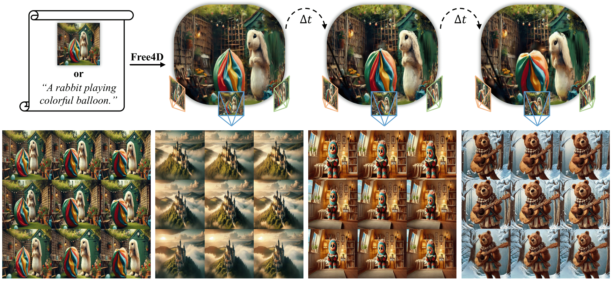

## ***Free4D: Tuning-free 4D Scene Generation with Spatial-Temporal Consistency***

<div>
<div align="center">
    <a href='http://tqtqliu.github.io/' target='_blank'>Tianqi Liu</a><sup>1,2,*</sup>&emsp;
    <a href='https://inso-13.github.io/' target='_blank'>Zihao Huang</a><sup>1,2,*</sup>&emsp;   
    <a href='https://frozenburning.github.io/' target='_blank'>Zhaoxi Chen</a><sup>2</sup>&emsp;       
    <a href='https://wanggcong.github.io/' target='_blank'>Guangcong Wang</a><sup>3</sup>&emsp;
    <a href='https://skhu101.github.io/' target='_blank'>Shoukang Hu</a><sup>2</sup>&emsp;<br>
    <a href='https://leoshen917.github.io/' target='_blank'>Liao Shen</a><sup>1,2</sup>&emsp;
    <a href='https://huiqiang-sun.github.io/' target='_blank'>Huiqiang Sun</a><sup>1,2</sup>&emsp;
    <a href='http://english.aia.hust.edu.cn/info/1030/1072.htm' target='_blank'>Zhiguo Cao</a><sup>1</sup>&emsp;
    <a href='https://weivision.github.io/' target='_blank'>Wei Li</a><sup>2,†</sup>&emsp;
    <a href='https://liuziwei7.github.io/' target='_blank'>Ziwei Liu</a><sup>2,†</sup>
</div>
<div>
<div align="center">
    <sup>1</sup>Huazhong University of Science and Technology&emsp;
    <sup>2</sup>Nanyang Technological University&emsp;
    <sup>3</sup>Great Bay University
</div>
<div align="center">
<sup>*</sup>Equal Contribution&emsp;  <sup>†</sup>Corresponding Authors
</div>

<p align="center">
  <a href="https://arxiv.org/abs/2503.20785" target='_blank'>
    
  </a>
  <a href="https://free4d.github.io/" target='_blank'>
    
  </a>
  <a href="https://youtu.be/GpHnoSczlhA">
    
  </a>
  <a href="#">
    
  </a>
</p>


>**TL;DR**: <em>Free4D is a tuning-free framework for 4D scene generation.</em>

<details>
<summary>Click to expand Free4D introduction</summary>


</details>

<details>
<summary>Click to expand 4D interactive viewer demo</summary>


</details>

## 🌟 Abstract
We present **Free4D**, a novel tuning-free framework for 4D scene generation from a single image. Existing methods either focus on object-level generation, making scene-level generation infeasible, or rely on large-scale multi-view video datasets for expensive training, with limited generalization ability due to the scarcity of 4D scene data. In contrast, our key insight is to distill pre-trained foundation models for consistent 4D scene representation, which offers promising advantages such as efficiency and generalizability. **1)** To achieve this, we first animate the input image using image-to-video diffusion models followed by 4D geometric structure initialization. **2)** To turn this coarse structure into spatial-temporal consistent multiview videos, we design an adaptive guidance mechanism with a point-guided denoising strategy for spatial consistency and a novel latent replacement strategy for temporal coherence. **3)** To lift these generated observations into consistent 4D representation, we propose a modulation-based refinement to mitigate inconsistencies while fully leveraging the generated information. The resulting 4D representation enables real-time, controllable spatial-temporal rendering, marking a significant advancement in single-image-based 4D scene generation.
<div style="text-align:center">

</div>

## 🛠️ Installation
### Clone Free4D
  ```
  git clone https://github.com/TQTQliu/Free4D.git
  cd Free4D
  ```
### Setup environments
  ```
  # Create conda environment
  conda create -n free4d python=3.11
  conda activate free4d
  pip install -r requirements.txt
  pip install torch==2.4.1 torchvision==0.19.1

  # Softmax-splatting
  pip install git+https://github.com/Free4D/splatting

  # PyTorch3D
  conda install https://anaconda.org/pytorch3d/pytorch3d/0.7.8/download/linux-64/pytorch3d-0.7.8-py311_cu121_pyt241.tar.bz2

  # Gaussian Splatting renderer
  pip install -e lib/submodules/depth-diff-gaussian-rasterization
  pip install -e lib/submodules/simple-knn

  # Install colmap on headless server
  conda install conda-forge::colmap
  ```
### Download pretrained models
  ```
  sh scripts/download_ckpt.sh
  ```

## 🚀 Usage

For a single image or text input, we first use an off-the-shelf video generation model (such as [KLing](https://klingai.com/), [Wan](https://github.com/Wan-Video/Wan2.1), [CogVideo](https://github.com/THUDM/CogVideo), etc.) to obtain a single-view video. Then, run the following commands for 4D generation. We have provided some pre-generated video frames in `data/vc`. Below, we take the scene `fox` as an example.

```
# Multi-View Video Generation
sh scripts/run_mst.sh fox

# organize data
python lib/utils/organize_mst.py -i output/vc/fox/fox -o data/gs/fox

# colmap
sh ./scripts/colmap.sh fox

# 4DGS training
python train_mst.py -s data/gs/fox --expname fox

# 4DGS rendering.
python render.py --model_path output/gs/fox
```
The rendered multi-view video will be saved in `output/gs/fox/test`. For camera trajectory setup, please refer [here](docs/render_help.md).

Here is an alternative solution that does not use [MonST3R](https://monst3r-project.github.io/), but instead employs [DUSt3R](https://dust3r.europe.naverlabs.com/) and optical flow.
```
# Multi-View Generation for the first frame
sh scripts/run_dst.sh fox

# organize data
python lib/utils/organize_dst.py -vd data/vc/fox -mv output/vc/fox_dst/0000 -o data/gs/fox_dst

# colmap
sh ./scripts/colmap.sh fox_dst

# 4DGS training and Flow-guided Multi-View Video Generation
python train_dst.py -s data/gs/fox_dst --expname fox_dst

# 4DGS rendering
python render.py --model_path output/gs/fox_dst
```

## 📚 Citation
If you find our work useful for your research, please consider citing our paper:

```
 @article{liu2025free4d,
     title={Free4D: Tuning-free 4D Scene Generation with Spatial-Temporal Consistency},
     author={Liu, Tianqi and Huang, Zihao and Chen, Zhaoxi and Wang, Guangcong and Hu, Shoukang and Shen, liao and Sun, Huiqiang and Cao, Zhiguo and Li, Wei and Liu, Ziwei},
     journal={arXiv preprint arXiv:2503.20785},
     year={2025}
 }
```

## ♥️ Acknowledgement
This work is built on many amazing open-source projects shared by [4DGaussians](https://guanjunwu.github.io/4dgs/), [ViewCrafter](https://drexubery.github.io/ViewCrafter/), [MonST3R](https://monst3r-project.github.io/), [DUSt3R](https://dust3r.europe.naverlabs.com/), and [VistaDream](https://vistadream-project-page.github.io/). Thanks all the authors for their excellent contributions!

## 📧 Contact
If you have any questions, please feel free to contact Tianqi Liu <b>(tq_liu at hust.edu.cn)</b>.
